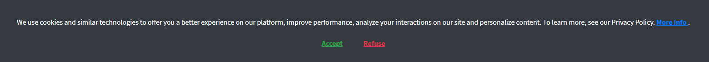

# Pop-up cookie acceptance terms for Laravel 5.5+, 6, 7, 8

[](https://packagist.org/packages/tjgazel/laravel-accept-cookies)
[](https://github.com/tjgazel/laravel-accept-cookies/blob/master/LICENSE)
[](https://packagist.org/packages/tjgazel/laravel-accept-cookies)

<br>



<br>

- Dependencies
    - Boostrap 4
    - JQuery 3
- [installation and configuration](#instalation)
- [Tanks](#tanks)

<br>

> See examples in: <br>
> https://alfaunipac.com.br <br>
> https://unipacto.com.br <br>
> https://faculdadealfa.com.br <br>

<a name="instalation"></a>

## installation and configuration

**1)** Run `composer require tjgazel/laravel-accept-cookies` to include this in your project. Will automatically
discover the provider and the alias.

<br>

**2)** Run `php artisan vendor:publish --provider="TJGazel\Laravel\AcceptCookies\AcceptCookiesProvider" --tag="accept-cookies:config"`
to publish the config file in `config/accept-cookies.php`. <br>

```php
<?php

return [
    'sessionName' => 'accept-cookies',

    'route' => [
        'middleware' => [],
        'prefix' => 'accept-cookies',
        'name' => 'accept-cookies.',
        'route' => [
            'name' => 'accept',
            'url' => '/accept'
        ]
    ],

    'background-color' => 'bg-dark',
    'text' => 'We use cookies and similar technologies to offer you a better experience on our platform, improve performance, analyze your interactions on our site and personalize content. To learn more, see our Privacy Policy.',

    'linkMoreInfoUrl' => 'https://my-site.com/storage/more-info.pdf',
    'linkMoreInfoTarget' => '_blank',
    'linkMoreInfoText' => 'More info.',
    'linkMoreInfoCollor' => 'text-primary',

    'btnAcceptText' => 'Accept',
    'btnAcceptColor' => 'text-success',

    'btnRefuseText' => 'Refuse',
    'btnRefuseColor' => 'text-danger',
];
```

<br>

**3)** Include `AcceptCookies::routes()` in `routes/web.php`.

```php
<?php

AcceptCookies::routes();

Route::get('/', function() {
    //
});
```

<br>

**4)** 1 - Include `@stack('js')` after jquery and boostrap scripts.  
2 - Include`@include('accept-cookies::template')` somewhere in your template.

```html
<!DOCTYPE html>
<html lang="{{ app()->getLocale() }}">
<head>
    <link rel="stylesheet" type="text/css" href="/css/app.css">
</head>
<body>
<div id="app">
    <header></header>
      
    <main>
        @yield('content')
    </main>

    <footer></footer>

    @include('accept-cookies::template')
</app>
<script type="text/javascript" src="js/app.js"></script>
@stack('js')
</body>
</html>
```

<br>

**5)** *Optional:*
Run `php artisan vendor:publish --provider="TJGazel\Laravel\AcceptCookies\AcceptCookiesProvider" --tag="accept-cookies:views"`
to publish the template view. Modify the published template located
at `resources/views/vendor/accept-cookies/template.php` to your liking.


<br/> <br/>

<a name="tanks"></a>

### Tanks for:

[Bootstrap](http://getbootstrap.com/) <br>
[JQuery](http://jquery.com/) <br>
[Laravel](https://laravel.com/)

**Author:** Talles Gazel <br>
[Linkedin](https://www.linkedin.com/in/tallesgazel/)
